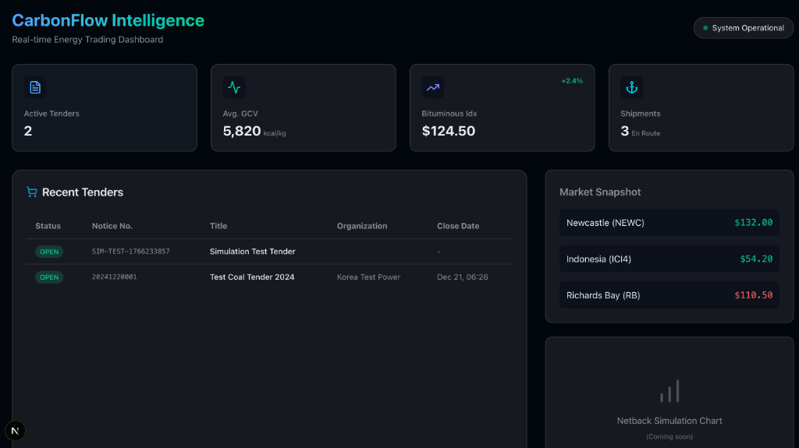
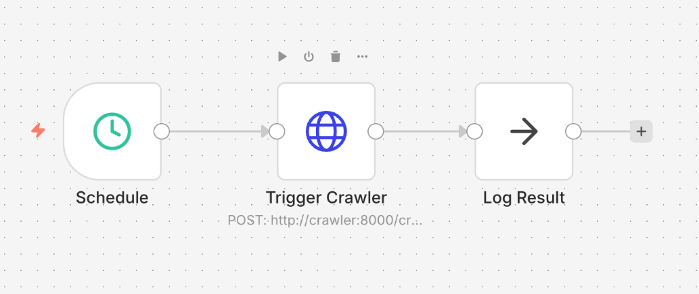

# 🔥 CarbonFlow Intelligence

실시간 석탄 입찰 공고 자동 수집 및 분석 시스템

---

## 📸 스크린샷

### Dashboard


### n8n Workflow Automation


### Supabase 저장 데이터 샘플

| 공고번호 | 공고명 | 발주기관 | 상태 |
|----------|--------|----------|------|
| SIM-TEST-1766233857 | Simulation Test Tender | - | OPEN |
| 20241220001 | Test Coal Tender 2024 | Korea Test Power | OPEN |

---

## ✨ 주요 기능

### 1. 자동 크롤링
- KEPCO SRM 포털에서 석탄 입찰 공고 자동 수집
- Playwright 기반 동적 웹 크롤링
- n8n 스케줄러로 4시간 주기 자동 실행

### 2. HWP 문서 파싱
- 한글 파일(.hwp)에서 석탄 규격 자동 추출
- 발열량(GCV), 유황분, 회분, 수분 등 핵심 스펙 파싱

### 3. 실시간 대시보드
- Glassmorphism 다크 테마 UI
- Supabase 실시간 연동
- 핵심 지표(KPI) 및 시장 가격 표시

### 4. 데이터 파이프라인
- Supabase PostgreSQL 클라우드 저장
- Docker Compose 기반 서비스 오케스트레이션

---

## 🛠 기술 스택

| 분류 | 기술 |
|------|------|
| Backend | Python 3.12, FastAPI, Playwright |
| Database | Supabase (PostgreSQL) |
| Frontend | Next.js 15, Tailwind CSS v4 |
| Automation | n8n, Docker |

---

## 🚀 실행 방법

### 1. 환경 설정
```bash
cp .env.example .env
# .env 파일에 Supabase 키 입력
```

### 2. Docker로 실행
```bash
docker-compose up -d
```

### 3. 대시보드 실행
```bash
cd dashboard
npm install
npm run dev
```

### 4. 접속
- **n8n**: http://localhost:5678
- **Dashboard**: http://localhost:3000
- **API**: http://localhost:8000

---

## 📂 프로젝트 구조

```
├── crawlers/           # Python 크롤러
│   ├── kepco/          # KEPCO 전용 크롤러
│   ├── repository.py   # Supabase 연동
│   └── main.py         # FastAPI 서버
├── dashboard/          # Next.js 대시보드
├── n8n/                # 워크플로우 설정
├── supabase/           # DB 마이그레이션
└── docker-compose.yml
```

---

## 📊 데이터 모델

- `tenders` - 입찰 공고
- `tender_attachments` - 첨부파일
- `tender_specs` - 석탄 규격
- `market_data` - 시장 지수
- `shipments` - 선적 정보

---

## 📝 License

MIT
