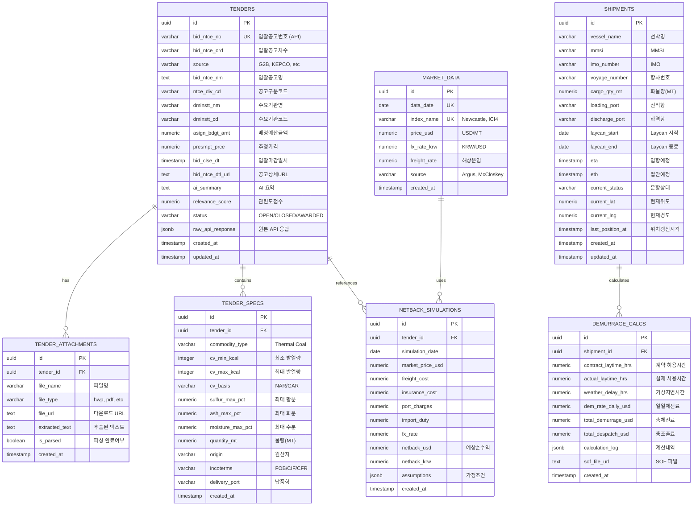

# CarbonFlow ERD (Entity Relationship Diagram)

본 문서는 실제 공공데이터포털 API 응답 구조를 분석하여 설계한 데이터베이스 ERD입니다.

---

## 데이터 소스 분석

### G2B (나라장터) API 응답 필드
`getBidPblancListInfoThng` 오퍼레이션 기준:

| API 필드명 | 한글명 | 데이터 타입 | 비고 |
|-----------|--------|------------|------|
| bidNtceNo | 입찰공고번호 | VARCHAR | PK, 예: "20160439522" |
| bidNtceOrd | 입찰공고차수 | VARCHAR | 예: "00" |
| bidClsfcNo | 입찰분류번호 | VARCHAR | |
| rbidNo | 재입찰번호 | VARCHAR | |
| ntceDivCd | 공고구분코드 | VARCHAR | 1=조달청, 2=자체 등 |
| bidNtceNm | 입찰공고명 | TEXT | 공고 제목 |
| asignBdgtAmt | 배정예산금액 | NUMERIC | 설계 금액 |
| presmptPrce | 추정가격 | NUMERIC | |
| bidClseDt | 입찰마감일시 | TIMESTAMP | |
| dminsttNm | 수요기관명 | VARCHAR | 발주처 |
| dminsttCd | 수요기관코드 | VARCHAR | |
| bidNtceDtlUrl | 공고상세URL | TEXT | 상세페이지 링크 |
| rgstDt | 등록일시 | TIMESTAMP | |

---

## ERD Diagram

---

## 설계 원칙

1. **API 원본 보존**: `raw_api_response` 필드로 원본 JSON 저장
2. **정규화**: 첨부파일과 스펙은 별도 테이블로 분리
3. **확장성**: JSONB 필드로 미래 필드 추가 대응
4. **추적성**: 모든 테이블에 `created_at`, `updated_at` 포함
